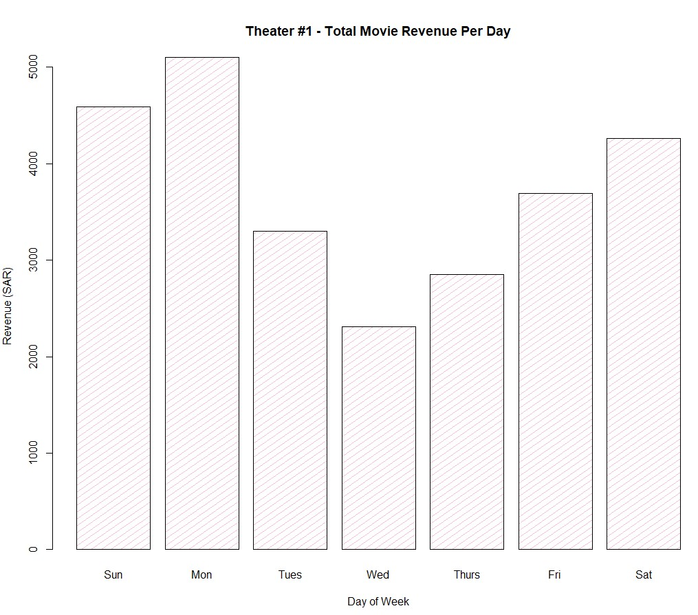
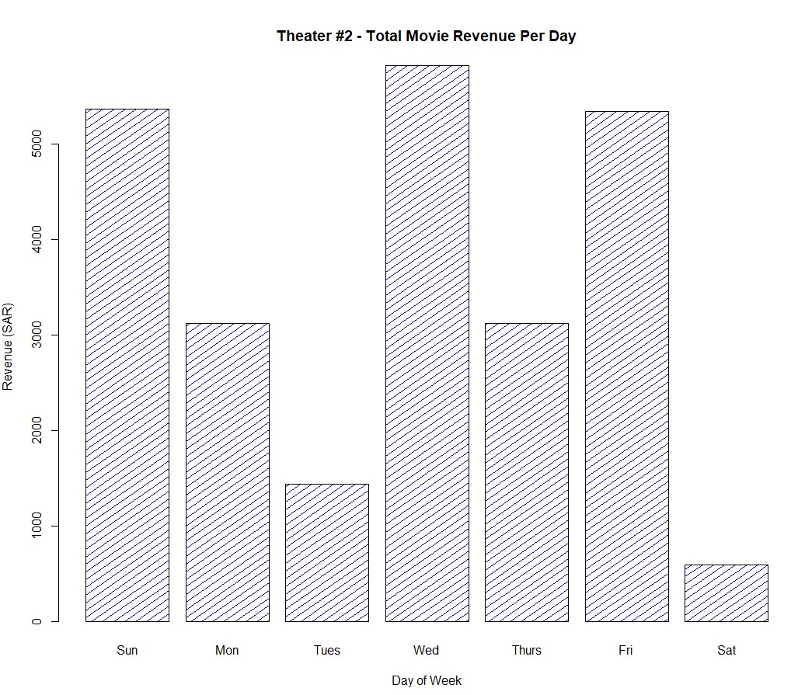

# Coding-Dojo-R-Project

## Introduction:
**Team Members:**

- [Farah Sidina](https://github.com/faro7ah)
- [Bedoor Alharbi](https://gist.github.com/ibedoor)
- Shaima Alamri
- Rahaf Shiqdar

**In this project, we used the R language**
1. We Determined the ticket costs for children and adults
2.  We List our 5 favourite movies
3. We Determined how many movie theatres screens our theatre has
4. We Determined how many seats each theatre seats
5. We used Loop over each day of the week
6.  We Keep track of total revenue for each day
7. We used Loop over each screen in the theatre
8. We Determined randomly how many adults and children are present in the theatre and we make sure the total occupants are not more than seats in the theatre.
9. We Calculated how much revenue was generated for children and adults
10. We Calculated total revenue and add to the total for the day
11. We  Saved the total revenue for the day to the appropriate index location in your week variable.
12. We Make a bar chart showing total revenue for each day.
13. We Make another chart of our choice.
14. We decided Which day has the highest revenue?
### Team members:
- [Bedoor Alharbi](https://gist.github.com/ibedoor)
- [Farah Sidina](https://github.com/faro7ah)
- Shaima Alamri

**Optional Tasks:**
1. We created snacks (Popcorn, chocolate, candy, etc.) and associate a price for each item created. We created a condition statement that determined whether a customer bought a snack or not. We even decided if children should be able to buy snacks.

2. We Pretend multiple theatres and run two simulations to represent each theatre and plot the results. (The theatres should not have the same number of screens or seating capacity per theatre).
3. We created a conditional statement for movies that may be PG-13 and not appropriate for kids and make sure your code reflects that kids cannot watch the movie.

**Team members:**
- [Bedoor Alharbi](https://gist.github.com/ibedoor)
- [Farah Sidina](https://github.com/faro7ah)

## Visualization Part:
We visualized our results to convey our message and finding out the results.

## Results:
**It is illustrated from the Bar charts, that Monday showing the highest rate of revenue of theatre #1, then theatre #2 recorded the highest rate of revenue with 6000 SAR approximately.**

**The bar chart illustrates that candy showing the highest rate of purchases on the other hand popcorn showing the lowest purchases rate.**

## Ptoject Tools and functions:
1. [Sample](https://www.rdocumentation.org/packages/base/versions/3.6.2/topics/sample)
2. [rbind](https://www.rdocumentation.org/packages/SparkR/versions/2.4.6/topics/rbind)
3. [rep](https://www.rdocumentation.org/packages/base/versions/3.6.2/topics/rep)
3. [order](https://www.rdocumentation.org/packages/base/versions/3.6.2/topics/order)
4. [barplot](https://www.rdocumentation.org/packages/graphics/versions/3.6.2/topics/barplot)
5. [cat](https://www.rdocumentation.org/packages/base/versions/3.6.2/topics/cat)
6. [which](https://www.rdocumentation.org/packages/base/versions/3.6.2/topics/which)

